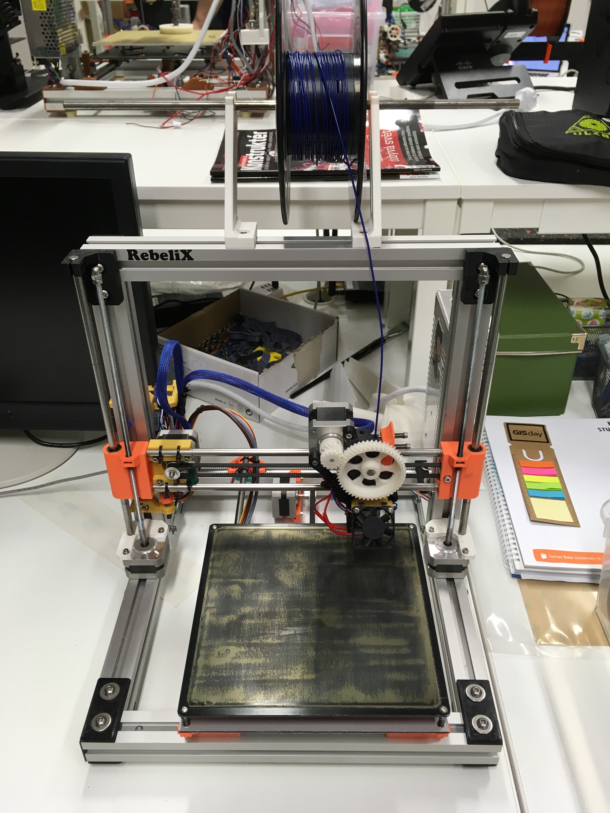

# Rebelix - PEI
Lab experimental printer with PEI sheet and aluminium plate. Thermal runaway is disabled.




## Printer configurations

* **Hot end:** RebelMOD 
* **Electornics:** RAMPS

Current configurations is obtained by:

```
  M503    ; Print current settings
  M503 S0 ; Print current settings as replayable G-code
```

###M503 output

```
>>> M503
SENDING:M503
echo:Steps per unit:
echo:  M92 X160.00 Y160.00 Z4000.00 E420.00
echo:Maximum feedrates (mm/s):
echo:  M203 X300.00 Y300.00 Z2.50 E25.00
echo:Maximum Acceleration (mm/s2):
echo:  M201 X3000 Y3000 Z100 E10000
echo:Accelerations: P=printing, R=retract and T=travel
echo:  M204 P3000.00 R3000.00 T3000.00
echo:Advanced variables: S=Min feedrate (mm/s), T=Min travel feedrate (mm/s), B=minimum segment time (ms), X=maximum XY jerk (mm/s),  Z=maximum Z jerk (mm/s),  E=maximum E jerk (mm/s)
echo:  M205 S0.00 T0.00 B20000 X5.00 Z0.40 E5.00
echo:Home offset (mm):
echo:  M206 X0.00 Y0.00 Z0.00
echo:PID settings:
echo:  M301 P17.65 I1.33 D58.55 C100.00 L20
echo:Filament settings: Disabled
echo:  M200 D3.00
echo:  M200 D0
```

###M503 S0 output

```
>>> M503 S0
SENDING:M503 S0
  M92 X160.00 Y160.00 Z4000.00 E420.00
  M203 X300.00 Y300.00 Z2.50 E25.00
  M201 X3000 Y3000 Z100 E10000
  M204 P3000.00 R3000.00 T3000.00
  M205 S0.00 T0.00 B20000 X5.00 Z0.40 E5.00
  M206 X0.00 Y0.00 Z0.00
  M301 P17.65 I1.33 D58.55 C100.00 L20
  M200 D3.00
  M200 D0

```
Optional `M500` command for store parameters into eeprom


